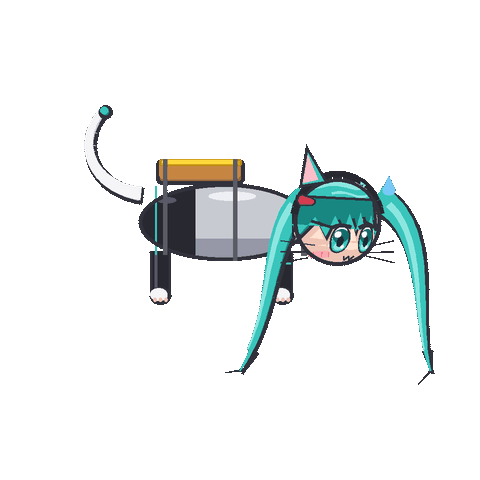

# miku-butter-paradox — バター猫のパラドックス × ねこみみミク

「猫は必ず足を下にして着地する」「バターを塗ったトーストは必ずバター面を下にして落ちる」
→ 猫の背中にバター面を上にしたトーストを固定すると、どちらも下になれず**着地できずに回り続ける**、
というネットミーム（[バター猫のパラドックス](https://ja.wikipedia.org/wiki/バター猫のパラドックス)）を、
猫要素（猫耳・ヒゲ・尻尾・肉球）を残したちびキャラの初音ミクで描いたループアニメーション。



## 成果物 (`output/`)

| ファイル | 内容 |
| --- | --- |
| `buttercat_miku_alpha.gif` | キャラのみ・背景透過 GIF（1 ビット透過。縁は主線色でマット処理） |
| `buttercat_miku_alpha.png` | キャラのみ・背景透過 **APNG**（フルアルファ。対応環境ではこちらの方が縁がきれい） |
| `buttercat_miku.gif` | 背景・集中線・字幕・オノマトペ付きのアニメ調版 |
| `keyframe_00/09/18/27.png` | 0° / 90° / 180° / 270° の静止画（確認用、透過 PNG） |

共通仕様: 480×480、36 フレーム、45ms/フレーム（1 周 約1.6 秒）、無限ループ。

## 生成方法

```sh
pip install -r requirements.txt      # Pillow のみ
python generate.py                   # 透過版 (GIF + APNG) → output/
python generate.py --with-bg         # 背景付き版も出力
python generate.py --keyframes       # 静止画キーフレームも出力
python generate.py --out somewhere   # 出力先を変える
```

字幕フォントは macOS のヒラギノ → Noto Sans CJK → メイリオの順で探し、無ければ Pillow 標準フォントに落ちる
（透過版はテキストを使わないので環境差は出ない）。

## 作りの要点（`generate.py`）

- **回転軸**: 横向き全身図で、頭〜尻尾を通る体軸まわりの**ローリング**。前転ではない。
  背中のトーストは「上（バター面上）→手前（バター面が見える）→下（バター面下）→奥（胴体に隠れる）」と一周する。
- **擬似 3D**: 胴体の断面座標 `(u: 接線方向, v: 半径方向)` を `proj(u, v, phi)` で画面 y と奥行きに変換。
  トースト・四つ足・尻尾はこの座標で定義し、奥行きの符号で胴体の前後に振り分けて描く。
- **頭部**: 球面上の点として顔パーツを置き、`yaw()`（首を進行方向へ 25° 振る = 3/4 視点）→ `roll()`（胴体と同じロール）で変換。
  正面を向いたときだけ顔が見え、90° で頭頂部、180° で後頭部、270° で顎側が見える。
  球面の裏側に回った点はシルエット（外周）にクランプして描画崩れを防ぐ。
- **ツインテール**: 頭部座標系の 3D ベジェ曲線。頭の向きに追従し、中間部の奥行きで胴体の前後を判定する
  （首を振っている分、胴体側のツインテールは正面姿勢のとき胴体の手前に来る）。
- **アニメ調**: 全パーツを「暗い色の全体形＋左上へずらした明るい色」の 2 トーンでセルシェーディング、
  太い主線、上が暗く下が明るい虹彩＋2 つのハイライトの瞳、髪の天使の輪、割れた毛先。
- **透過 GIF**: GIF は 1 ビット透過なので、主線色 `OUT` をマットにして合成した後に 255 色へ量子化し、
  インデックス 255 を透明にしている。フルアルファが必要なら APNG を使う。

調整しやすい定数: `FRAMES`/`DUR`（速さ）、`PSI`（首の振り角）、`TOAST_*`（トーストの大きさ）、
`LEG_L`（足の長さ）、`draw_twin_tails` / `draw_cat_tail` 内のベジェ制御点（髪と尻尾の形）。

## 注記

初音ミクはクリプトン・フューチャー・メディア株式会社のキャラクターです。本作は
[ピアプロ・キャラクター・ライセンス](https://piapro.jp/license/pcl/summary) に基づく非営利のファンアートとして作成しています。
